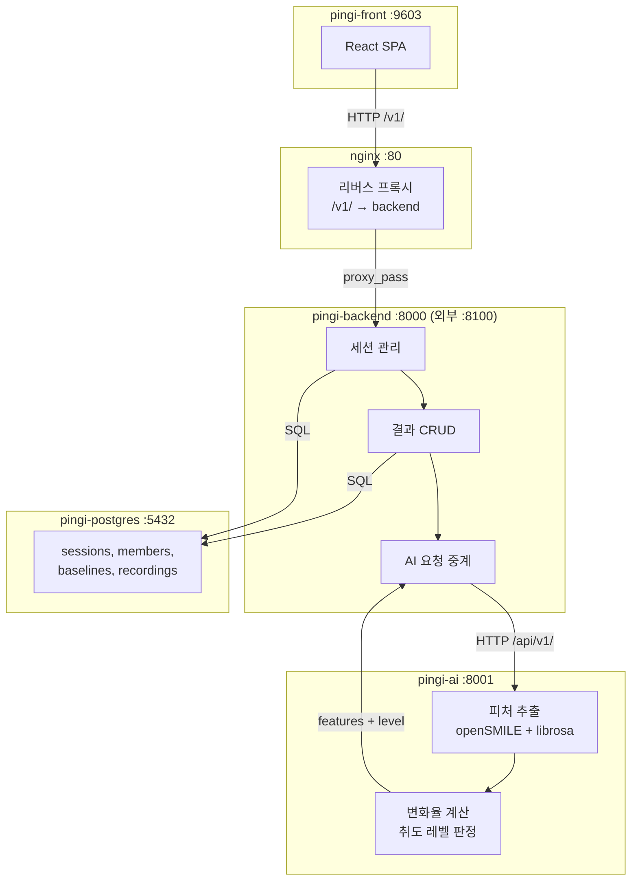
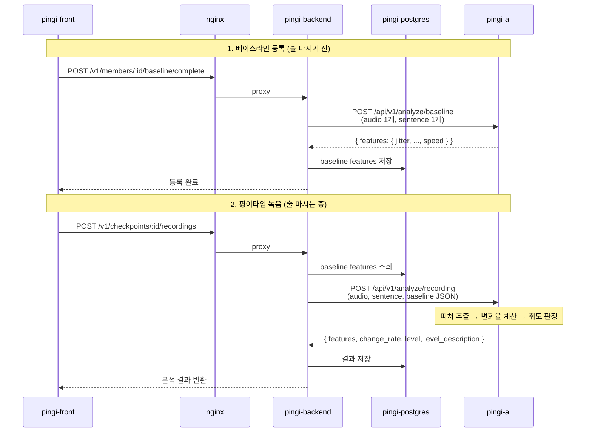

# Pingi-ai

핑이(Pingi) 서비스의 **음성 분석 AI 서버**. 술자리에서 녹음한 음성에서 9가지 음향 특징을 추출하고, 베이스라인 대비 변화율 및 취도(0~5 레벨)를 판정하여 pingi-backend에 반환한다.

> pingi-ai는 pingi-backend에서만 호출되며, 프론트엔드가 직접 접근하지 않는다.

## 아키텍처



## 분석 플로우



## 분석 엔진

| 엔진                     | 역할           | 추출 피처                                             |
| ------------------------ | -------------- | ----------------------------------------------------- |
| **openSMILE eGeMAPSv02** | 음향 피처 추출 | jitter, shimmer, HNR, F1, F2, loudness, F0, F0 변동성 |
| **librosa**              | 발화 속도 측정 | speed (초당 음절 수 기반)                             |

### 추출 피처 (9가지)

| 피처          | 설명                            | openSMILE 통계량 | 가중치 |
| ------------- | ------------------------------- | ----------------- | ------ |
| **speed**     | 발화 속도 (음절/초, librosa)    | —                 | 20%    |
| **F0 변동성** | 기본 주파수 변동성              | stddevNorm        | 18%    |
| **HNR**       | 조화음 대비 잡음 비율 (dB)      | amean             | 15%    |
| **F0**        | 기본 주파수 평균 (semitone)     | amean             | 12%    |
| **jitter**    | 성대 떨림 주기 불규칙성         | amean             | 9%     |
| **shimmer**   | 음성 진폭 불안정성 (dB)         | amean             | 9%     |
| **loudness**  | 음량 변동성                     | stddevNorm        | 9%     |
| **F1**        | 제1 포먼트 발화 내 변동성       | stddevNorm        | 4%     |
| **F2**        | 제2 포먼트 발화 내 변동성       | stddevNorm        | 4%     |

### 취도 레벨 기준

| 레벨 | 설명           | 변화율 구간        |
| ---- | -------------- | ------------------- |
| 0    | 멀쩡해요       | < 5%                |
| 1    | 살짝 취기      | 5% ~ 15%           |
| 2    | 기분 좋은 취기 | 15% ~ 30%          |
| 3    | 제법 취함      | 30% ~ 50%          |
| 4    | 많이 취함      | 50% ~ 70%          |
| 5    | 만취           | ≥ 70%              |

## 사전 요구 사항

- **Python** 3.11+
- **ffmpeg** (오디오 포맷 변환에 필요)

```bash
# macOS
brew install ffmpeg

# Ubuntu / Debian
sudo apt install ffmpeg
```

## 설치 및 실행

```bash
# 1. 저장소 클론
git clone <repository-url>
cd pingi-ai

# 2. 가상환경 생성 및 활성화
python -m venv .venv
source .venv/bin/activate

# 3. 의존성 설치
pip install -r requirements.txt

# 4. 환경 변수 설정
cp .env.example .env
# 필요 시 .env 파일을 수정한다

# 5. 서버 실행 (개발)
uvicorn main:app --port 8001 --reload

# 5-alt. 서버 실행 (프로덕션)
uvicorn main:app --port 8001 --workers 2
```

서버가 기동되면 `http://localhost:8001/docs`에서 Swagger UI를 확인할 수 있다.

### Docker

```bash
docker compose up -d --build
```

> `pingi_net` 외부 네트워크가 필요하다. 없으면 `docker network create pingi_net`으로 생성한다.

## 환경 변수

| 변수       | 기본값  | 설명                                  |
| ---------- | ------- | ------------------------------------- |
| `PORT`     | `8001`  | 서버 실행 포트                        |
| `TEMP_DIR` | `./tmp` | 오디오 변환 시 사용하는 임시 디렉토리 |

## API 엔드포인트

### `GET /api/v1/health`

서버 상태를 확인한다.

```json
{
  "status": "ok",
  "model": "opensmile-eGeMAPSv02",
  "version": "0.1.0"
}
```

### `POST /api/v1/analyze/baseline`

맨정신 상태의 음성 1개를 분석하여 개인 음성 기준선(features)을 생성한다.

**Request** `multipart/form-data`

| 필드       | 타입   | 설명             |
| ---------- | ------ | ---------------- |
| `audio`    | file   | 녹음 파일        |
| `sentence` | string | 문장 텍스트      |

**Response**

```json
{
  "features": {
    "jitter": 0.012,
    "shimmer": 0.45,
    "hnr": 12.3,
    "f1": 0.25,
    "f2": 0.18,
    "loudness": 0.35,
    "f0": 28.5,
    "f0_var": 0.045,
    "speed": 0.88
  }
}
```

### `POST /api/v1/analyze/recording`

핑이타임 녹음에서 9개 음향 피처를 추출하고, 베이스라인 대비 변화율 및 취도 레벨을 산출한다.

**Request** `multipart/form-data`

| 필드       | 타입   | 설명                                                   |
| ---------- | ------ | ------------------------------------------------------ |
| `audio`    | file   | 핑이타임 녹음 파일                                     |
| `sentence` | string | 기대 문장 텍스트                                       |
| `baseline` | string | 베이스라인 피처 JSON. 예) `'{"jitter":0.012,...}'` |

**Response**

```json
{
  "features": {
    "jitter": 0.018,
    "shimmer": 0.62,
    "hnr": 9.8,
    "f1": 0.35,
    "f2": 0.28,
    "loudness": 0.42,
    "f0": 30.1,
    "f0_var": 0.078,
    "speed": 0.72
  },
  "change_rate": 23.5,
  "level": 2,
  "level_description": "기분 좋은 취기"
}
```

## 프로젝트 구조

```
pingi-ai/
├── main.py                          # FastAPI 엔트리포인트
├── docker-compose.yaml              # Docker Compose (pingi_net)
├── Dockerfile                       # Python 3.12-slim + ffmpeg
├── app/
│   ├── config.py                    # 환경 변수 설정 (pydantic-settings)
│   ├── api/
│   │   ├── router.py                # 라우터 통합
│   │   ├── health.py                # GET  /api/v1/health
│   │   ├── baseline.py              # POST /api/v1/analyze/baseline
│   │   └── recording.py             # POST /api/v1/analyze/recording
│   ├── models/
│   │   └── schemas.py               # Pydantic 요청/응답 스키마
│   ├── services/
│   │   ├── analyzer.py              # 분석 파이프라인 (피처 추출 + 취도 계산)
│   │   ├── feature_extractor.py     # openSMILE + librosa 피처 추출
│   │   └── audio_converter.py       # 오디오 → 16kHz 모노 wav 변환
│   └── utils/
│       └── level_calculator.py      # 변화율 → 취도 레벨 변환
├── tests/                           # pytest 테스트
├── requirements.txt                 # Python 의존성
├── pytest.ini                       # pytest 설정
├── .env.example                     # 환경 변수 템플릿
└── test_main.http                   # HTTP 요청 테스트 파일
```

## 테스트

```bash
# 전체 테스트 실행
pytest

# 상세 출력
pytest -v

# 특정 테스트만 실행
pytest -k "level"
```

## 기술 스택

- **FastAPI** — 비동기 REST API 프레임워크
- **uvicorn** — ASGI 서버
- **openSMILE** — eGeMAPSv02 음성 피처 추출
- **librosa** — 발화 속도 계산
- **pydub + ffmpeg** — 오디오 포맷 변환
- **pydantic-settings** — 환경 변수 기반 설정 관리
